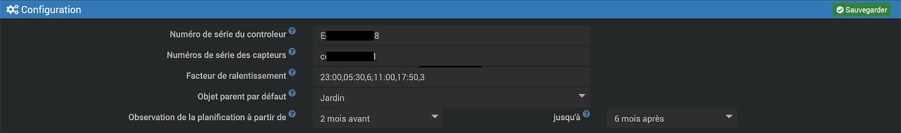

# Plugin Netro Arrosage

Ce plugin permet de gérer l'écosystème [Netro](https://netrohome.com/) permettant, grace à son controleur et l'ensemble de ses capteurs, d'assurer l'arrosage automatique de votre jardin. Il s'appuie sur l'API Public de Netro.

## Description

Le contrôleur Netro est relié aux electrovannes qui vont chacune alimenter une zone particulière de votre jardin. Le nombre de zones maximum pouvant être gérées dépend du modèle de controleur que vous possédez. Seuls les zones effectivement connectées aux electrovannes pourront être géré par le systèmem Netro et par conséquent par le plugin.

Les équipements du plugin sont de trois types :

* le controleur
* les zônes pilotées par le controleur
* les capteurs de sol qui permettent de mesure l'humidité et la température du sol ainsi que la quantité de lumière reçue

Le plugin permet de gérer un controleur et l'ensemble des zones et capteurs qui font partie de votre système

## Configuration

Avant de faire quoique ce soit, il faut renseigner le *numéro de série du contrôleur* et ceux *des capteurs* de sol que vous possédez. Vous trouverez ces numéros de série dans l'app Netro sur votre smartphone.

Les données du contrôleur sont rafraichies toutes les 5 mn (cron5) et celles des capteurs toutes les 10 mn (cron10). On peut également rafraichir manuellement à partir de l'équipement contrôleur. **Il est important de ne pas abuser de ces "refresh" dans la mesure ou Netro limite à 2000 le nombre d'appels par jour à son API**.

Il est probable que vous décidiez de ne pas arroser à certaines heures de la nuit, dans ce cas on pourra ralentir la fréquence de rafraichissement en définissant un *facteur de ralentissement* sur la période concernée. Le formalisme est évoqué un peu plus bas dans la rubrique **fonctions avancées**.

L' *objet parent par défaut* désigne l'objet auquel vous rattacher vos équipements Jeedom Netro (ici *Jardin*).
